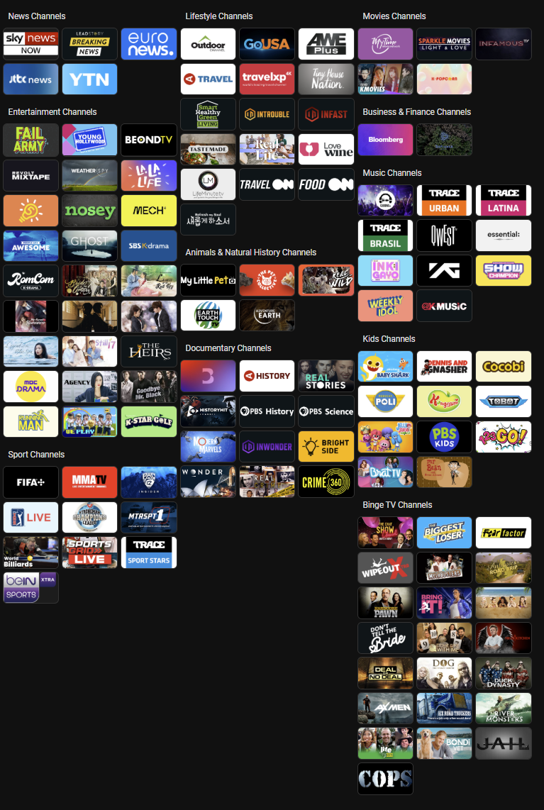

# LG Channels Web Scraper and Home Assistant Dashboard Generator

## Overview

This project includes a Python-based web scraper designed to extract TV channel information from the LG Channels webpage, alongside a script to generate a YAML dashboard for Home Assistant. The project fetches details like category, brand, channel number, channel name, and description, saves the data in a JSON file, and downloads the associated brand images to a specified directory. It also generates a structured Home Assistant dashboard in YAML format, allowing users to interact with their LG TVs directly from Home Assistant.

This project uses the [webostv integration](https://www.home-assistant.io/integrations/webostv/) in Home Assistant to enable communication with LG webOS TVs.

## Features

- Scrapes TV channel information and organizes it into structured JSON format.
- Downloads brand images to a local directory.
- Generates a Home Assistant YAML dashboard with views for multiple TVs and categorized channels.
- Modular code with separate functions for web scraping, image downloading, and YAML generation.
- Easy to customize for your TVs and channels.

## Requirements

- Python 3.7 or later
- Libraries:
  - `requests`
  - `beautifulsoup4`
  - `PyYAML`
  - `os`
  - `json`

